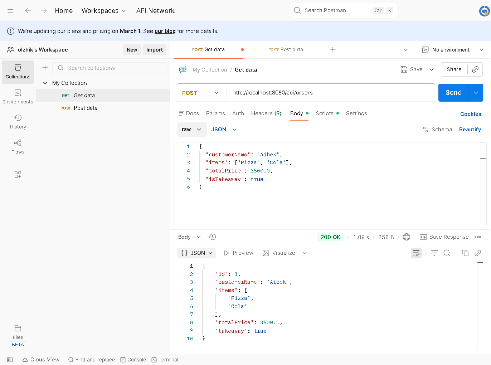
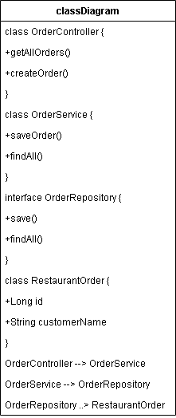

# Restaurant Management System - Endterm Project

## A. Project Overview
* This project is a Spring Boot RESTful API for managing restaurant orders. It implements creational design patterns, component principles, and maintains a layered architecture connected to a PostgreSQL database.

## B. REST API Documentation
* **Endpoints:**
    * GET /api/orders` - Retrieve all orders.
    * POST /api/orders` - Create a new order.
* **Request Body (JSON):**
```
{
  "customerName": "Aibek",
  "items": ["Pizza", "Burger"],
  "totalPrice": 4300.0,
  "isTakeaway": true
}
```
# C. Design Patterns Section

* Singleton: Used for application configuration to ensure a single shared instance across the application.


* Factory: Implemented in DishFactory to create subclasses like Pizza and Burger based on the abstract Dish class.


* Builder: Used in RestaurantOrder to construct complex order objects with optional fields.


# D. Component Principles Section
The project follows these principles:


* REP (Reuse/Release Equivalence): Logic is modularized into repository, service, and patterns packages.


* CCP (Common Closure): Classes that change together are grouped together.


* CRP (Common Reuse): Packages are structured to avoid unnecessary dependencies.

# E. SOLID & OOP Summary

* Single Responsibility: Each layer (Controller, Service, Repository) has one specific role.


* Open/Closed: New dish types can be added to the Factory without changing existing code.


* Dependency Injection: Managed by Spring Boot to decouple components.

# F. Database Schema

* Database: PostgreSQL.

* Table: orders.

* Columns: id (Primary Key), customer_name, items (list), total_price, is_takeaway.

# G. System Architecture Diagram
* The flow follows: Client -> REST Controller -> Service -> Repository -> Database.

# H. Instructions to Run
* Configure application.properties with your PostgreSQL credentials.

* Create a database named restaurant_db.

* Run RestaurantApplication.java.

* Test endpoints via Postman at http://localhost:8080/api/orders.

# I. Reflection
* This project demonstrated the migration of a layered Java application into a Spring Boot API. I integrated design patterns and component principles to ensure a professional backend architecture.

## B. REST API Documentation


## G. System Architecture & UML

